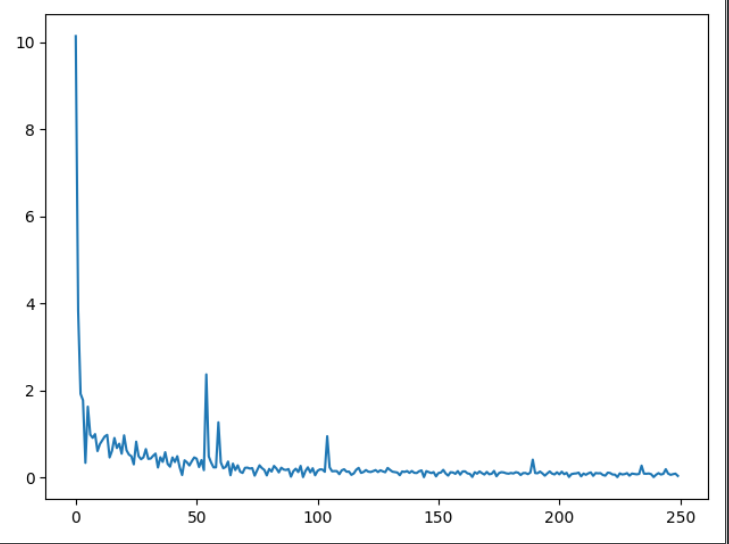
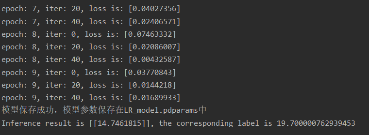

# Boston-Home-Price-Forecast
Boston house price prediction based on paddlepaddle and numpy, respectively


###XDU Introduction to Artificial Intelligence First Assignment
***
```
#Modify according to your own path
datafile = 'housing.data'
```
### **1. Note**
- **Numpy_house_predict**:
Not based on any deep learning framework, only numpy implementation

- **Paddle_house_predict**:
Based on deep learning framework "Paddlepaddle"

- **Tensor_3**:
Implementing data pre-processing and reading


### **2. Question discribie**
- The Boston house price dataset is derived from a dataset from an American economics journal that analyzes house prices in Boston. Each row of data in this dataset is an overview of house prices in the Boston neighborhood or town, with the median house price and 13 indicators, in an attempt to analyze the relationship between these indicators and house prices.

### **3. Final show**
- 
- 

### **4. About author**
- Student majored in artificial intelligence from XDU
- [Personal Blog](https://blog.csdn.net/qq_49392169)
- QQ: 2539110495